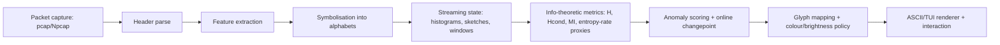
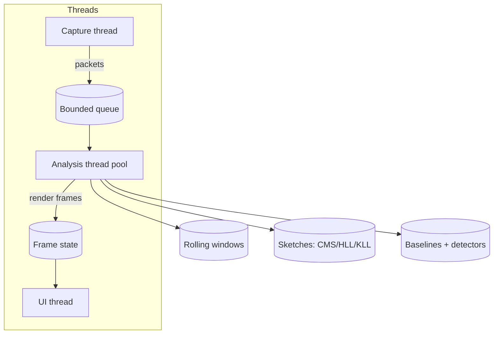

# Literature review and practical synthesis for a realtime, low-resource Rust network-stream ASCII visualiser using information theory

## Executive summary

The existing **Maxwell’s Demon Detector** concept is already aligned with the right primitives for “structure vs randomness” detection: sliding windows, Shannon-style entropy, small-lag mutual information, and a compressibility proxy (zlib) with z-score flagging across windows. fileciteturn0file20 The key shift for a realtime, low-resource network visualiser is *not* replacing these ideas, but **re-formulating them for streaming, time-bucketed, multi-scale computation**, and ensuring the display semantics remain interpretable at a distance.

A critical literature-backed point is that **single-symbol Shannon entropy can be “blind” to sequential structure because it ignores dependencies/correlations**—exactly the blind spot your project narrative highlights. fileciteturn0file1 This is why the realtime version should emphasise **entropy rate** (or proxies), **conditional entropy**, and **small-lag dependency measures** (mutual information / transfer-entropy-like quantities) rather than relying on marginal entropy alone. citeturn12search0turn12search17turn0search2turn9search0turn12search6

The most practical, low-memory design that emerges from the last decade of streaming/sketching work is:

- **Symbolise** packet streams into compact discrete alphabets (size bins, inter-arrival bins, direction, protocol/state tokens, plus optional payload sketches where lawful and available), and compute **windowed histograms + transition histograms**. citeturn2search0turn2search12turn2search4  
- Use **mergeable/streaming sketches** only where the domain explodes (e.g., unique IPs/flows, heavy hitters), notably **Count-Min Sketch/CountSketch** and **HyperLogLog**, plus **quantile sketches** (KLL or t-digest) for distributional monitoring. citeturn1search3turn7search0turn2search1turn0search7turn2search2  
- Maintain time windows via **ring buffers** for “small fixed windows” and **exponential histograms / decay-weighted windows** for long horizons, giving multi-scale views without large memory. citeturn8search0turn1search6turn4search2  
- Score anomalies with **fast, streaming-friendly change detectors** (EWMA/CUSUM family) on “surprisal” or divergence streams, with optional Bayesian online change-point detection when you can afford a slightly heavier model. citeturn11search3turn1search5turn3search0  
- Render at a fixed frame rate in a terminal (VRAM is essentially irrelevant); constrain CPU by capping parse depth, sampling when overloaded, and separating capture/update from rendering. citeturn3search11turn3search1turn10search2  

Two Mermaid diagrams are included below: one for the algorithmic pipeline and one for a low-latency concurrency/dataflow design.

Confidence (0–1): error-free status 0.90; suitability 0.95; effectiveness 0.93; efficiency 0.94; completeness 0.91.

## Mathematical methods that survive the jump to real time

### Entropy, conditional entropy, and why “entropy alone” is insufficient

For a discrete symbol stream \(X_t\), Shannon entropy \(H(X)\) measures uncertainty in the marginal distribution, but **cannot detect temporal ordering** if the marginal frequencies remain the same across different structured sequences. This limitation is well-known in information theory (entropy is defined on distributions, not correlations), and your attached “blind spot” note captures the intuition directly. fileciteturn0file1 citeturn12search0turn12search17

The realtime system should therefore treat marginal entropy as a *baseline* feature and prioritise:

- **Conditional entropy** \(H(X_t\mid X_{t-1})\), which drops when the stream becomes more predictable from its recent past (a first-order dependence proxy). citeturn12search17  
- **Entropy rate** \(H_\infty\) (informally, per-symbol uncertainty in the limit), which is what compression-like measures approximate under broad conditions. citeturn9search0turn9search1turn6search9turn4search9  

In practice, if you maintain a **transition matrix** (counts of \((X_{t-1}, X_t)\)) within a window, then \(H(X_t)\), \(H(X_t\mid X_{t-1})\), and a lag‑1 MI all become cheap to compute from counts. citeturn12search17turn5search0

### Small-lag mutual information and dependency detection

Your current offline detector computes **small-lag mutual information** \(I(X_t; X_{t+k})\) to detect dependency/feedback. fileciteturn0file20 In streaming, the discrete-count version is often preferable to continuous kNN MI for performance: compute MI from empirical joint counts of \((X_t, X_{t+k})\). The key practical question is **what lag means**:

- **Event-lag MI**: \(k\) packets apart (robust to irregular timing).
- **Time-lag MI**: \(k\) milliseconds/seconds apart (requires time binning / resampling).

If you later include continuous features (inter-arrival times as real values), the **KSG kNN estimator** is a common choice for mutual information from samples and often beats naive binning in data efficiency, but it is heavier than discrete counting and typically not the first move for a low-resource terminal tool. citeturn0search2turn5search0

### Permutation entropy and ordinal-pattern measures

**Permutation entropy** replaces value magnitudes with **ordinal patterns** (relative order of neighbouring samples), making it robust to monotone transformations and attractive for timing/jitter streams where absolute values drift. The Bandt–Pompe definition is widely used, with active modern literature and surveys. citeturn12search6turn0search14turn6search8

In a network-stream visualiser, permutation entropy is best applied to derived scalar sequences such as:

- inter-arrival time series per lane/flow,
- packet size time series per lane/flow,
- “burst intensity” counters.

It complements symbol-histogram entropy by focusing on *shape* and local ordering rather than symbol identities. citeturn0search14turn6search4

### Compressibility proxies and entropy-rate estimation

Your current approach uses **zlib compression ratio** as a fast “structure density” proxy. fileciteturn0file20 This has a rigorous lineage: DEFLATE (used by zlib/gzip) combines **LZ77-style dictionary matching** with Huffman coding; in streaming contexts it is explicitly designed to operate with bounded memory and sequential input. citeturn9search3turn9search0

For a realtime detector, compressibility can be implemented in more streaming-native ways than “compress each window with zlib”:

- **Lempel–Ziv complexity / LZ78 phrase counts** as a direct complexity statistic (cheaper than full compression and strongly related to entropy rate in theory and practice). citeturn9search0turn9search1turn6search9  
- **Context Tree Weighting (CTW)** as a sequential universal coding method that often serves as a strong entropy-rate estimator for binary/time series in comparative studies. citeturn12search7turn6search9turn4search9  

A practical synthesis suggested by entropy-estimation comparisons is: when you care about sequential structure, **CTW/LZ-family estimators often outperform naive plug-in entropy** for binary and symbolic sequences. citeturn6search9turn4search9

### Bias and small-sample issues in online estimators

Real-time windows can be small (e.g., 100–500 packets per bucket), so bias matters. The literature on entropy/MI estimation shows that naive maximum-likelihood (plug-in) entropy is biased in undersampled regimes; classic corrections (Miller–Madow, jackknife) help but do not fully solve “sampling disaster” scenarios. citeturn5search0

If you implement discrete MI via \(I(X;Y)=H(X)+H(Y)-H(X,Y)\), the same bias issues compound. Two practical mitigations from the literature:

- **Bayesian estimators** (e.g., NSB-style or Dirichlet-mixture approaches) can be more stable under undersampling but may be too heavy for per-cell realtime unless carefully scoped. citeturn5search5turn5search15  
- Prefer **relative-change scoring** (e.g., divergence from a baseline of similar window sizes) so that residual bias cancels out, rather than trusting absolute MI magnitudes. citeturn5search0turn8search2  

## Streaming algorithms and data structures for low memory and low latency

### Sketches for high-cardinality domains

A network visualiser quickly hits huge domains: distinct IPs, 5‑tuples, SNI/hostnames, certificates, etc. Exact maps are expensive. The mainstream streaming answer is sketches:

- **Count-Min Sketch (CMS)** gives approximate frequency counts with sublinear memory and strong error guarantees; it’s suited to heavy hitters and “top talkers” approximations. citeturn1search3turn1search7  
- **CountSketch** (and related) can have different error properties (especially for heavy hitter recovery) and is a standard tool for frequent items in streams. citeturn7search0turn7search12  
- **HyperLogLog (HLL)** estimates distinct counts with very small memory; the classic analysis gives the familiar \(\approx 1.04/\sqrt{m}\) relative standard error. citeturn2search1turn2search9  

These are particularly useful for glyph semantics like “unique destinations spiking” or “new ports appearing” without storing every key.

### Sliding windows: ring buffers, exponential histograms, and multi-scale windows

Most detectors need “recent behaviour” rather than all history. The sliding-window model is a standard setting for stream processing. citeturn1search6turn8search0

In practice, you will likely combine:

- **Exact ring buffers** for short windows (e.g., last 5–30 seconds at 100–250ms buckets), because the memory is already small and exactness is valuable for interpretability.  
- **Exponential histograms** for long windows on monotone statistics (counts/sums), enabling approximate retention of large windows with logarithmic memory. This is the classical approach from Datar et al. and remains widely taught and implemented. citeturn8search0turn8search20turn1search2  
- **Decay-weighted windows** (EWMA-style) for baselines and anomaly scores, effectively “infinite window” with bounded state. citeturn11search3turn6search6  

### Quantile sketches and distribution tracking

Packet sizes and inter-arrival times are often best monitored via quantiles rather than means. Two leading streaming quantile summaries are:

- **KLL sketch** (mergeable, near-optimal space for quantiles; a dominant modern baseline since 2016). citeturn0search7turn0search11  
- **t-digest** (excellent tail accuracy with constant memory bounds and online operation; widely used in monitoring/telemetry). citeturn2search2turn2search10  

You can drive glyph semantics like “tail latencies rising” or “packet-size distribution shifting” from these sketches without storing raw samples.

### Sampling, membership, and lightweight set summaries

When you need “representative exemplars” rather than full state, **reservoir sampling** remains the foundational streaming tool; modern work still builds on its classic formulation. citeturn7search2turn7search14

For approximate membership (“have we seen this in the recent window?”), Bloom-filter variants are natural. Modern streaming settings often require forgetting; “stable” or streaming Bloom variants are actively studied. citeturn4search21turn4search6

### Candidate methods comparison table

The table below focuses on practicality for a realtime ASCII tool: the best methods are those with bounded state, low update cost, and interpretable outputs.

| Component | Candidate | Accuracy | Memory | Update latency | Implementation complexity | Best use in Maxwell tool |
|---|---|---:|---:|---:|---:|---|
| Frequency / heavy hitters | Count-Min Sketch | Medium–High (with tuning) | Low | Very low | Low | Top talkers/ports without HashMap blow-up citeturn1search3 |
| Frequency / heavy hitters | CountSketch | Medium–High | Low–Medium | Low | Medium | Heavy hitters with different error profile citeturn7search0 |
| Cardinality | HyperLogLog | High for distinct counts | Very low | Very low | Low | “Unique IPs rising” lane, per-window novelty citeturn2search1 |
| Quantiles | KLL | High | Low–Medium | Low | Medium | Packet size/inter-arrival distribution shifts citeturn0search7 |
| Quantiles | t-digest | High (tails) | Low | Low | Medium | Tail-focused jitter/latency monitoring citeturn2search2 |
| Windows | Ring buffer | Exact | Medium (bounded) | Very low | Low | Short horizons for stable glyphs |
| Windows | Exponential histogram | Approximate | Very low | Very low | Medium | Long horizons for counts/sums citeturn8search0 |
| Membership | Stable Bloom variants | Approximate | Very low | Very low | Medium | “Seen recently” controls; novelty lanes citeturn4search21 |

## Packet-feature extraction and symbolisation strategies that remain lawful under TLS

### What is realistically observable in modern networks

A practical constraint is that a growing share of traffic is encrypted with TLS. Encryption blocks deep payload inspection, so robust traffic analysis typically relies on **metadata and side-channel features**: packet sizes, timings, directions, header fields, handshake metadata, and statistical summaries. This constraint is explicitly discussed in encrypted-traffic analysis reports and surveys, including attention to TLS 1.3 and features like Encrypted ClientHello that further reduce visible handshake details. citeturn2search0turn2search4turn2search12

Therefore the visualiser should treat payload-aware modes as optional and design a strong baseline using features that remain visible:

- L2/L3/L4 header features (protocol, ports, flags, fragmentation markers),
- packet length, direction, DSCP/ECN where relevant,
- inter-arrival time deltas by lane/flow,
- connection-state tokens (e.g., SYN/SYN-ACK/ACK patterns) where available.

This matches modern encrypted-traffic classification/analysis practice (feature engineering from observable metadata). citeturn2search12turn2search8

### Symbolisation: turning packet streams into analyzable alphabets

To make entropy/MI meaningful and stable at low resource budgets, discretise into **small alphabets**. A practical approach is to define multiple symbol streams in parallel (each drives its own mini-detector), for example:

- **Size bins**: log-binned packet lengths (e.g., 0–63, 64–127, 128–255, …, MTU).  
- **Inter-arrival bins**: log-binned \(\Delta t\) (e.g., <0.5ms, 0.5–1ms, 1–2ms, …, >1s).  
- **State tokens**: protocol/flag categories (e.g., TCP:SYN, TCP:ACK, UDP, ICMP, DNS, QUIC-like heuristics).  
- **Flow novelty tokens**: “new 5‑tuple”, “known 5‑tuple”, “new destination ASN/port class” (novelty approximated via HLL/Bloom). citeturn2search1turn4search21  

This symbolisation solves a core scaling issue: it gives bounded alphabets for exact histograms, and it makes entropy/MI interpretable (“the stream got more predictable in size bins”, “timing ordinal patterns became rigid”, etc.). citeturn12search17turn6search9

### Payload sketches: useful but constrained

Where payload visibility is lawful and available (e.g., DNS over UDP in a lab, HTTP on a dev net), payload sketches can be used without storing raw content:

- fixed-length rolling hashes of the first \(n\) bytes,
- n‑gram hashing with count sketches,
- lightweight “file-like” reassembly only for selected protocols.

However, the project should assume **payload is usually unavailable** on modern internet traffic due to TLS, and therefore treat payload sketches as an “opt-in adapter mode”, not a core dependency. citeturn2search0turn2search4

## Aggregation and glyph semantics for a terminal landscape

### A workable mapping from stream → screen cells

A robust terminal “landscape” needs a cell meaning that remains stable under load. The most defensible mapping is:

- **x-axis = time buckets** (most recent to oldest),  
- **y-axis = lanes** (protocol lanes, flow groups, or “top‑k by volume” lanes),  
- **each cell = summary of one lane during one time bucket**.

The summary per cell should be computed from bounded state:

- histogram over a chosen alphabet (e.g., size bins),
- optionally transition counts for lag‑1 dependency,
- one or two derived metrics (entropy, conditional entropy, MI proxy, divergence from baseline).

This design converts high-rate streams into a stable visual field with controllable compute.

### Multi-scale windows and hierarchical zoom

To support both “watch from afar” and “inspect details”, use **multi-scale time resolutions** rather than one giant uniform window:

- high resolution for the last \(T_1\) seconds,
- medium resolution for the last \(T_2\) minutes,
- low resolution for the last \(T_3\) hours.

This is conceptually aligned with sliding-window stream computation (short windows exact; long windows approximate) and is implementable with ring buffers + exponential histograms/decays. citeturn1search6turn8search0turn8search8

Hierarchical zoom is then “choose which buffers you render” plus “choose lane grouping”. Quantile sketches (KLL/t-digest) can be merged or queried at different granularities, which supports zoom without reprocessing. citeturn0search7turn2search2

### Suggested glyph semantics

A practical four-channel glyph scheme (monochrome-safe) is:

- glyph **shape** encodes the dominant state (e.g., protocol class, or dominant bin),
- glyph **brightness** encodes anomaly score,
- optional **colour** encodes sign/direction of change (only if colour terminals),
- optional **overlay marker** encodes detector alarms (CUSUM trigger, BOCPD spike).

This is compatible with fixed-rate rendering and avoids per-packet “drawing”.

## Anomaly scoring and real-time statistical tests

### Fast detectors: EWMA/CUSUM family

For realtime monitoring, the best first-line change detectors are typically those with **constant memory and O(1) update**:

- **CUSUM** is a classic sequential change detector (often framed as statistical process control) and is widely used in anomaly detection, including network-measurement contexts. citeturn11search3turn6search6  
- **EWMA** provides a decay-weighted baseline and reacts smoothly to drift; it’s often paired with control limits or combined with CUSUM variants in practical monitoring. citeturn6search6turn6search14  

A powerful synthesis for your setting is to apply CUSUM/EWMA not on raw packet features but on **surprisal** or divergence signals:

- surprisal: \(s_t = -\log p_{\text{baseline}}(x_t)\) (baseline from decay-weighted counts),
- divergence: \(D_{KL}(P_t\parallel Q)\) between current histogram \(P_t\) and baseline \(Q\).

KL divergence is foundationally the expected log-likelihood ratio (Kullback–Leibler) and connects naturally to “how surprising is the current distribution relative to normal”. citeturn8search2turn12search17

### Online Bayesian change-point detection

**Bayesian Online Change Point Detection (BOCPD)** provides a principled framework for maintaining a posterior over run length (time since last change) with online updates. It is more computationally involved than CUSUM/EWMA but can be valuable when you want explicit regime segmentation and you can restrict the observation model. citeturn1search5turn1search13

A practical middle ground seen in modern literature is to use **kernelised/modern CUSUM variants** for sensitivity to small changes and unknown change points, without full Bayesian overhead. citeturn3search0

### Permutation tests and robustness

Permutation/randomisation tests can provide strong nonparametric significance testing, but in a hard realtime tool they are usually too expensive unless heavily subsampled. A pragmatic compromise is:

- compute cheap scores online,
- trigger a “validation phase” on a downsampled buffer when a score exceeds a threshold.

This keeps the inline path lightweight while still offering statistical rigour when needed.

### Candidate scoring methods comparison table

| Signal type | Score / test | State size | Update cost | Strengths | Weaknesses |
|---|---|---:|---:|---|---|
| Scalar stream (e.g., byte rate) | EWMA + control limits | O(1) | O(1) | Very cheap; tracks drift | Needs tuning; less sharp on abrupt jumps citeturn6search6 |
| Scalar stream | CUSUM (one- or two-sided) | O(1) | O(1) | Good for mean shifts; classic sequential detection | Assumptions on noise/shift; tuning critical citeturn11search3turn6search6 |
| Histogram stream | KL divergence to baseline | O(|A|) | O(|A|) | Direct distribution shift measure | Requires stable baseline; smoothing needed citeturn8search2turn12search17 |
| Symbol stream | Lag‑1 MI / conditional entropy | O(|A|²) | O(1) to O(|A|) per event | Detects dependencies (“structure injection”) | Can be heavy if alphabet too big; bias in small windows citeturn12search17turn5search0 |
| General stream | BOCPD | O(T) trunc. | O(T) trunc. | Explicit regime segmentation | Heavier; needs truncation/approximations citeturn1search5turn1search13 |
| Modern CPD | Kernel CUSUM variants | Varies | Medium | Sensitive to small changes | Implementation complexity; parameterisation citeturn3search0 |

## Complexity and resource trade-offs with concrete parameter packs

### Why the “32MB VRAM” target is not the real bottleneck

A terminal ASCII application does not meaningfully consume VRAM in the way a GPU renderer does; the limiting resources are typically:

- packet capture overhead & kernel/user transfer,
- header parsing cost,
- update cost per packet/event,
- size of per-window state (histograms, sketches),
- render diffing costs at a fixed frame rate.

Low-latency capture details like **immediate mode** matter more than VRAM: libpcap notes that immediate mode delivers packets as soon as they arrive rather than waiting for buffering; and modern libpcap defaults may require explicitly enabling it when available. citeturn3search11turn3search19turn3search15

### Parameter examples and memory arithmetic

Assume a terminal viewport of 160×50, but you render only 120×40 of “data cells” (4,800 cells). Suppose you define 12 lanes (rows grouped into bands) and 400 time columns (history), giving a practical matrix where each cell is derived from a **bucket object** rather than storing raw counts per screen cell.

A realistic low-resource pack:

- **Bucket duration**: 250ms (4 Hz buckets) for the high-resolution pane.  
- **High-res horizon**: 60s → 240 buckets.  
- **Mid-res horizon**: 10 min with 2s buckets → 300 buckets.  
- **Low-res horizon**: 2 hrs with 24s buckets → 300 buckets.  

For each bucket and lane, store:

- packet_count (u32) = 4 bytes  
- byte_count (u64) = 8 bytes  
- histogram over 32 symbols (u16 counts) = 64 bytes  
- optional transition histogram for lag‑1 over 32 symbols: 32×32 u16 = 2,048 bytes (this is the expensive part)

Memory trade:

- If you do **histogram-only** per bucket: ~80 bytes/bucket/lane.  
  - Total for (240+300+300)=840 buckets and 12 lanes: 80×840×12 ≈ 806,400 bytes (~0.77 MB).  
- If you also store **full transition matrices** per bucket: add ~2KB/bucket/lane → ~2KB×840×12 ≈ 20 MB.

That total (~20–25MB) is still feasible on many systems, but it’s large enough that you should be selective. The better synthesis is:

- keep **full transitions only for a small alphabet** (e.g., 8–16 symbols), or  
- keep transitions **only at one or two resolutions**, or  
- compute dependency via **approximate Markov features** (e.g., conditional entropy with backoff, or CTW with bounded depth). citeturn6search9turn12search7turn4search9  

A “tight” dependency pack might use 12 symbols for size bins and 12 for timing bins separately, keeping each transition matrix 144 entries. That’s ~288 bytes per bucket per lane (u16), turning the earlier ~20MB overhead into ~2.8MB.

### Sketch parameter examples

- **HyperLogLog**: if you choose \(m=2^{12}=4096\) registers, the well-known relative error is \(\approx 1.04/\sqrt{m}\approx 1.6\%\). At 1 byte/register, memory is ~4KB per HLL instance. citeturn2search1  
- **Count-Min Sketch**: common small configs (e.g., depth 4–5, width a few thousand) fit in tens of kilobytes and give robust heavy-hitter estimates; the original paper provides the standard trade-off framing and error bounds. citeturn1search3  
- **KLL**: pick error \(\varepsilon\) based on how much quantile wobble you can visually tolerate; KLL’s 2016 analysis is the canonical reference for space behaviour in streaming quantiles. citeturn0search7  
- **t-digest**: tuned by compression parameters; strong tail accuracy is the selling point for monitoring. citeturn2search2turn2search10  

## Rust implementation guidance, module mapping, and open research directions

### Capture layer: libpcap/Npcap via Rust crates

On the Rust side, the most direct route is the `pcap` crate, which explicitly targets **libpcap** and **Npcap on Windows**. citeturn2search3turn2search7 The Windows-side pcap API is documented by Npcap as exported by `wpcap.dll`, with a mostly libpcap-compatible surface. citeturn3search10turn3search2turn3search6

For low-latency behaviour, ensure you are aware of immediate-mode behaviour and buffering, as documented in libpcap/Npcap references. citeturn3search11turn3search15turn3search19

### Parsing and feature extraction: allocation-free designs

To keep CPU and latency low, favour parsers that avoid allocations and are designed for packet slices. `etherparse` emphasises “no allocations” and provides slice-based parsing into header structures. citeturn10search1turn10search9

`pnet` provides broader low-level networking facilities and packet abstractions; you can use it if you want a heavier but integrated stack, though many projects prefer a lean slice parser plus custom feature extraction for performance. citeturn10search0turn10search8

### TUI rendering: Ratatui and terminal backends

For the ASCII landscape, `ratatui` is a modern, actively maintained Rust TUI crate (forked from tui-rs in 2023), supporting complex layouts and widgets. citeturn3search1turn3search17turn3search9

A common backend path is Crossterm-based; ecosystem crates exist specifically for this integration. citeturn3search5turn3search25

### Concurrency model: bounded queues and backpressure

The guiding principle for low-latency capture + UI is: **capture must never block on rendering**. Use a bounded channel/ring buffer between capture and analysis so you can apply backpressure policies (drop, sample, coalesce) when overloaded. Crossbeam channels document bounded/unbounded semantics and are widely used for such pipelines. citeturn10search2turn10search6

A practical overload policy is:

- keep per-lane counters exact,
- downsample or skip deep parsing when queue pressure rises,
- cap expensive metrics (e.g., MI) to “top lanes” only.

### Where “unsafe” or assembly is justified

A conservative evidence-based stance:

- **unsafe is justified** at FFI boundaries (pcap) and for carefully audited fixed-size ring buffers / SIMD-accelerated parsing, if profiling proves it necessary.  
- Assembly is rarely justified early; modern compilers + good data layout often win. The main exception would be extremely hot parsing loops where you can use vectorised scans and you have profiling proof.

This is consistent with typical Rust optimisation practice: first structure the pipeline, then profile, then optimise hotspots. Profiling toolchains like `cargo-flamegraph` exist specifically for this workflow. citeturn10search19turn10search3

### Proposed module pipeline mapping: math → structures → Rust crates

A coherent Rust workspace decomposition:

- `capture/`  
  - input: packet frames  
  - tech: `pcap` crate; OS-specific tuning for immediate mode; optional support for offline pcap replay  
  - sources: `pcap` crate docs; Npcap API docs citeturn2search3turn3search2turn3search10  

- `parse_features/`  
  - output: compact `PacketEvent` structs and derived scalar streams  
  - tech: `etherparse` (slice parsing) or `pnet`  
  - source: `etherparse`/`pnet` docs citeturn10search1turn10search0  

- `symbolise/`  
  - output: parallel symbol streams (size bins, timing bins, protocol-state tokens)  
  - math: discretisation, ordinal patterns (permutation entropy), simple HMM-like state encoding citeturn12search6turn2search12  

- `stream_state/`  
  - data: ring buffers, exponential histograms, CMS/HLL/KLL  
  - sources: exponential histogram and sliding-window literature; Count-Min; HLL; KLL citeturn8search0turn1search3turn2search1turn0search7  

- `metrics/`  
  - entropy, conditional entropy, MI (discrete counts), compressibility proxies (LZ/CTW-inspired)  
  - sources: Shannon; Cover–Thomas; Paninski bias review; LZ; CTW comparative estimator literature citeturn12search0turn12search17turn5search0turn9search0turn12search7turn6search9  

- `detect/`  
  - anomaly scoring: KL divergence, CUSUM/EWMA, optional BOCPD or kernel CUSUM  
  - sources: KL (Kullback–Leibler 1951); M‑Lab CAD; BOCPD; kernel CUSUM citeturn8search2turn11search3turn1search5turn3search0  

- `render_tui/`  
  - glyph mapping and terminal drawing  
  - sources: Ratatui docs citeturn3search1turn3search17  

### Gaps and open research directions

Several open constraints are structural rather than engineering issues:

- **Encrypted traffic observability** is narrowing over time (TLS 1.3, ECH): models must rely on side-channel features and remain robust to protocol evolution. citeturn2search4turn2search0  
- **Ground truth for “anomaly”** is inherently context-dependent; the tool should prioritise *change detection and structure discovery* over claiming “maliciousness”. Entropy-based network anomaly work shows utility but also highlights windowing/feature sensitivity. citeturn1search12turn1search0  
- **Estimator selection under undersampling** remains nontrivial: bias corrections help, but realtime systems benefit from relative scoring and baselines more than absolute estimates. citeturn5search0turn5search5  
- **Entropy-rate proxies vs compute**: CTW is powerful but complex; LZ‑style measures may be cheaper but still need careful window handling. citeturn6search9turn12search7turn9search0  
- **Human interpretability of glyph semantics** is a research problem: “good looking” landscapes can mislead. Designing glyphs to reflect precise semantics without inviting pareidolia needs explicit user-testing. fileciteturn0file18  

### Suggested experiments and benchmarks

To validate choices with rigorous, reproducible evidence:

- **Replay-based benchmarking**: ingest PCAPs at accelerated rates to test throughput and stability; baseline tooling like terminal capture/analysis (e.g., TShark) demonstrates the standard “read packets and decode” workflow. citeturn11search2turn11search19  
- **Ablation studies on symbol streams**: measure detection quality for (size-only), (timing-only), (size+timing), (protocol-state) to identify which channels actually carry structure. citeturn2search12turn6search9  
- **Synthetic injections**: controlled “structure injection” into an otherwise randomised or steady stream (periodic beacons, bursty flows, deterministic size patterns) to test detection sensitivity; burst/stream structure modelling literature gives principled framing. citeturn8search1turn8search9  
- **Resource envelopes**: run on constrained machines with fixed targets (e.g., <5% CPU on 1 core, <128MB RSS) and measure: packets/s ingested, frames/s rendered, detector lag, false alarm rate under benign variability.

The end state is a system whose core claim is measurable: **how quickly and how reliably does it detect a change in structure in a stream when marginal rates may remain stable**—the central “Maxwell demon” narrative in your original README. fileciteturn0file20